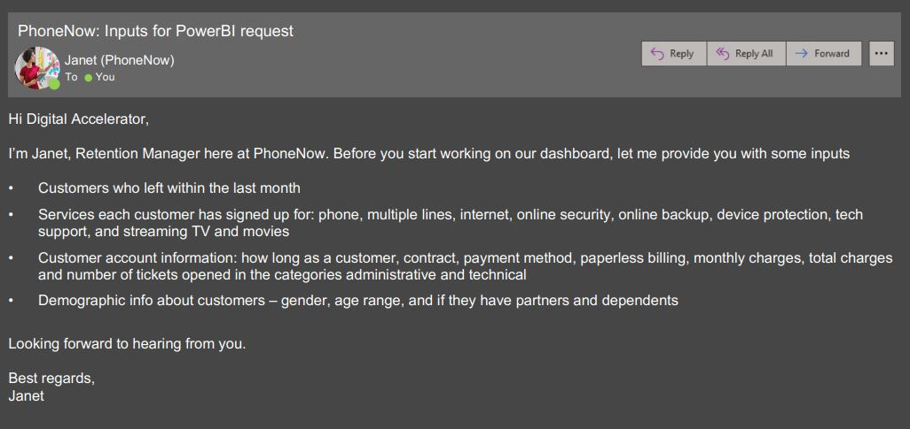
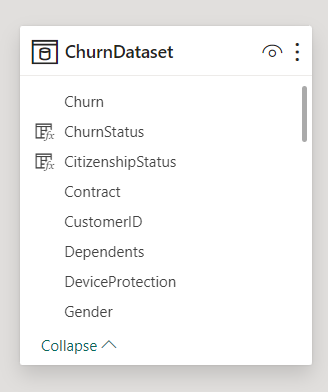
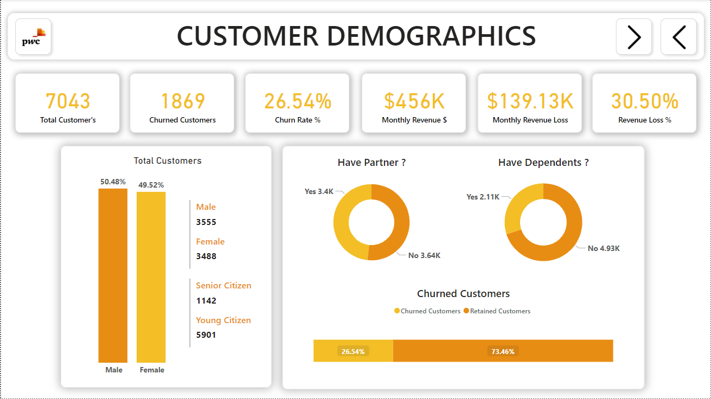
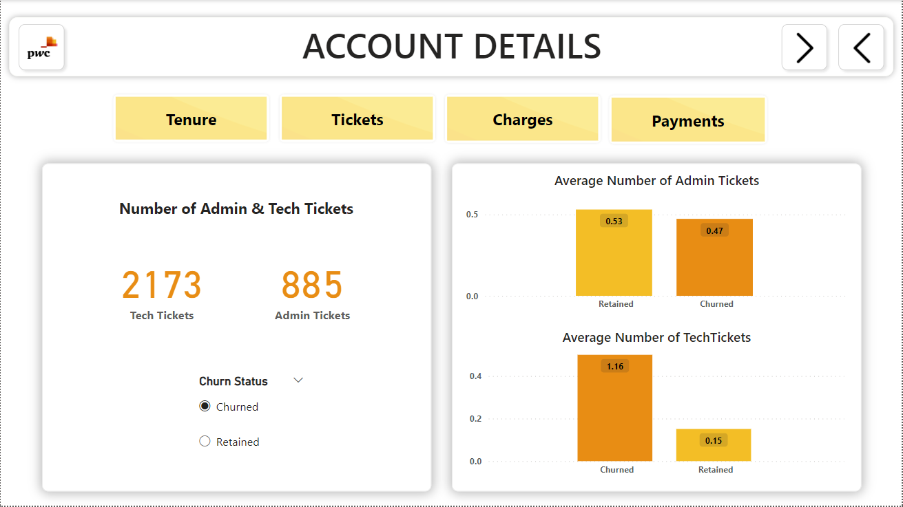
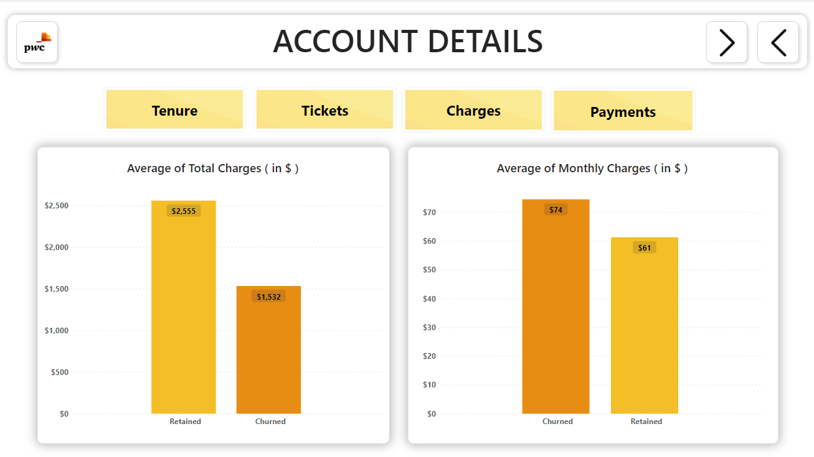
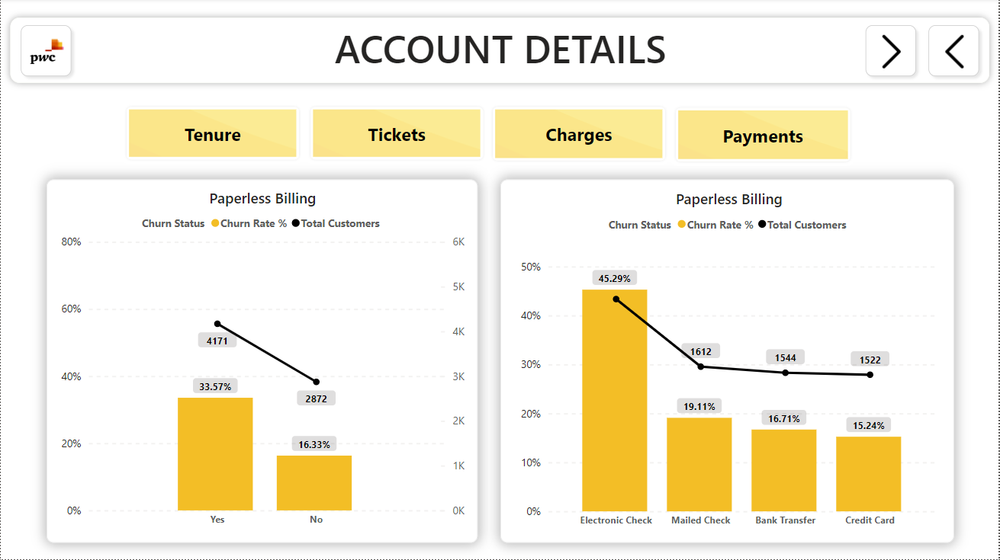
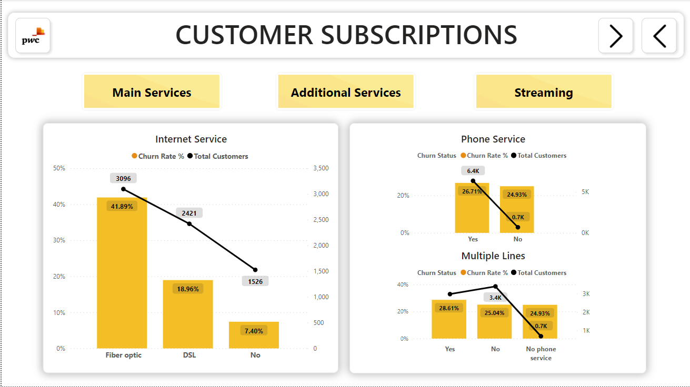
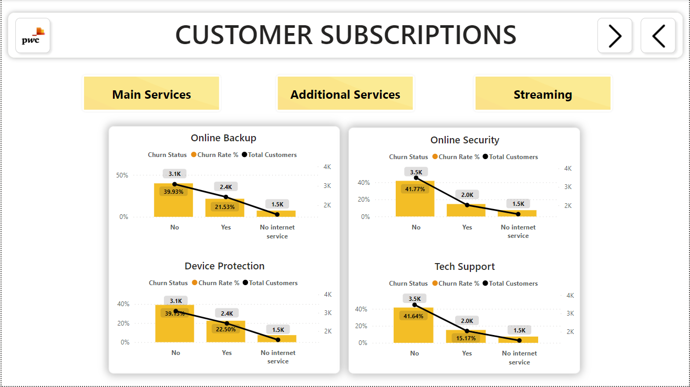
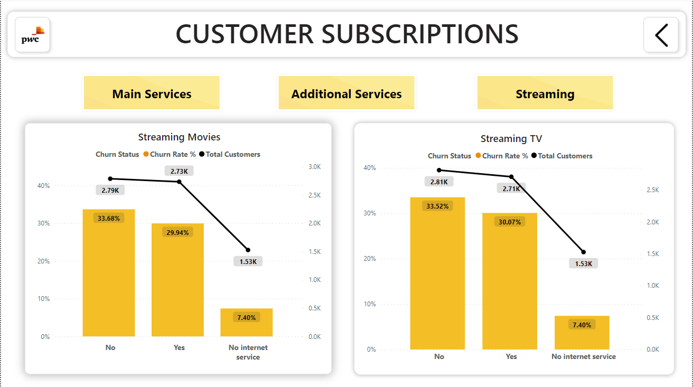

<a href="https://www.youtube.com/watch?v=dQw4w9WgXcQ"></a>

<div align="center">
    <h2 style="font-size: 44 px;"> Telecom Customer Churn-Analysis - Power BI </h2><br>
</div>

<p align="center">
  
  
  
</p>

<div align= "center">
    
</div>

<a href="https://www.youtube.com/watch?v=dQw4w9WgXcQ"></a>

## Background
Customers in the telecom industry are hard-earned, and like the Retention Manager from our telecom Client, no brand wants to lose them. A few weeks after presenting the [Telecom Customer Churn Analysis - Power-BI](https://github.com/shantanu1109/Telecom-Customer-Churn-Analysis-Power-BI) dashboard to the management, the Retention Manager from the telecom reached out directly to Shantanu. He was impressed by the work and asked for a dashboard about customer retention.

Additionally, the telecom Retention Manager scheduled a meeting with the engagement partner at PwC to better understand the data. Some points covered in the meeting include:

- Proactive Customer Retention: In the telecom industry, retaining customers is paramount. The retention department's primary objective is to re-engage customers in the event of contract termination. Presently, their approach is reactionary, reaching out post-termination. However, a proactive strategy to identify at-risk customers beforehand would be more effective.

- Past Analysis Limitations: Previous attempts at customer analysis using Excel have proven fruitless, resulting in dead-ends. This underscores the necessity for a more sophisticated and efficient analytical approach.

- Enhanced Customer Insight: There's a pressing need for comprehensive customer analysis within the telecom sector. Visual representations of this data, designed to be self-explanatory, are essential for effective communication with the management team. The retention manager has provided some resources to facilitate this process, highlighting its importance.

The retention manager also provided more context to the required dashboard through the email shown below


<a href="https://www.youtube.com/watch?v=dQw4w9WgXcQ"></a>

## Project Details
**What is Churn?** \
**Churn** refers to the rate at which customers stop doing business with a company or service, typically expressed as a percentage of the customer base.

**What is a Churn Rate?** \
**Churn Rate**, sometimes known as attrition rate, is the rate at which customers stop doing business with a company over a given period. Churn may also apply to the number of subscribers who cancel or don’t renew a subscription. The higher your churn rate, the more customers stop buying from your business. The lower your churn rate, the more customers you retain. Typically, the lower your churn rate, the better.

> **Churn Rate** = (Churned Customers / Total Number of Customers) x 100%

**What is Customer Churn?** \
Customer Churn refers to the natural business cycle of losing and acquiring customers. Every company — no matter the quality of its products or customer service experiences churn. In the context of businesses, customer churn can occur due to factors such as dissatisfaction with the product or service, competitive offerings, or changes in circumstances or preferences of the customer. Generally speaking, the less churn a company has, the more customers they keep.

<a href="https://www.youtube.com/watch?v=dQw4w9WgXcQ"></a>

## About the Data
The dataset is a Microsoft Excel file that contains one table, consisting of **7,043 rows and 23 columns** of **PhoneNow Telecoms** customer information, which includes, customer Demographics, Account Information, and Service Subscriptions. The data was gotten from [Forage]( https://cdn.theforage.com/vinternships/companyassets/4sLyCPgmsy8DA6Dh3/02%20Churn-Dataset.xlsx).

<a href="https://www.youtube.com/watch?v=dQw4w9WgXcQ"></a>

## Skills

```
- Data Cleaning
- Data Inspection
- Data Transformation
- Data Standardization
- Data Visualization
```

> **Data Inspection:** Visually inspect the data to identify errors, inconsistencies, or missing values.

> **Data Transformation:** Converting data from one format or structure to another, to make it more suitable for a specific task or analysis.

> **Data Standardization:** Converting data into a standard format, such as converting all text to lowercase or standardizing date formats.

<a href="https://www.youtube.com/watch?v=dQw4w9WgXcQ"></a>

## Data Preparation

The data transformation was finished using Power Query, and now the dataset is loaded into Microsoft Power BI Desktop for modeling purposes.

1. The Customer Churn dataset is given table named:

> - ChurnDataset which has 7043 rows and 23 columns of observation.

2. Data Cleaning for the dataset was done in the **Power Query Editor** as follows:

- Changed the Data type of customerID, gender, SeniorCitizen as given below:
> = Table.TransformColumnTypes(#"Promoted Headers",{{"customerID", type text}, {"gender", type text}, {"SeniorCitizen", Int64.Type}, 

- Replaced Value names of Mailed check, Electronic check, Bank transfer (automatic), Credit card (automatic) in the columns as given below:
```
1. = Table.ReplaceValue(#"Changed Type","Mailed check","Mailed Check",Replacer.ReplaceText,{"PaymentMethod"})
2. = Table.ReplaceValue(#"Replaced Value","Electronic check","Electronic Check",Replacer.ReplaceText,{"PaymentMethod"})
3. = Table.ReplaceValue(#"Replaced Value1","Bank transfer (automatic)","Bank Transfer",Replacer.ReplaceText,{"PaymentMethod"})
4. = Table.ReplaceValue(#"Replaced Value2","Credit card (automatic)","Credit Card",Replacer.ReplaceText,{"PaymentMethod"})
```

- Replaced Column Names of customerID, gender, tenure as given below:
> = Table.RenameColumns(#"Replaced Value3",{{"customerID", "CustomerID"}, {"gender", "Gender"}, {"tenure", "Tenure"}})

3. In the new table, two additional conditional columns were added using M-formula:
```
1. = CitizenshipStatus = IF('ChurnDataset'[SeniorCitizen] = 0, "Young Citizen", "Senior Citizen")
2. = ChurnStatus = IF('ChurnDataset'[Churn] = "Yes", "Churned", "Retained")
```
<a href="https://www.youtube.com/watch?v=dQw4w9WgXcQ"></a>

## Data Modeling

Then dataset was cleaned and transformed, it was ready for the data modeled.

The customer churn tables as shown below:
\


<a href="https://www.youtube.com/watch?v=dQw4w9WgXcQ"></a>

## Data Analysis (DAX):

Measures used in  all visualization are:

- Total Customers = `COUNT(ChurnDataset[CustomerID])`
- Churned Customers = `CALCULATE(COUNTA('ChurnDataset'[CustomerID]), 'ChurnDataset'[Churn] IN { "Yes" })`
- Retained Customers = `CALCULATE(COUNTA('ChurnDataset'[CustomerID]), 'ChurnDataset'[Churn] IN { "No" })`
- Percent of Churned Customer = `(ChurnDataset[Churned Customers] / [Total Customers])`
- Percent of Retained Customers = `([Retained Customers] / [Total Customers])`
- Churn Rate % = `ChurnDataset[Churned Customers] / COUNT(ChurnDataset[CustomerID])`
- ChurnStatus = `IF('ChurnDataset'[Churn] = "Yes", "Churned", "Retained")`
- Monthly Revenue Loss = `CALCULATE(SUM(ChurnDataset[MonthlyCharges]), ChurnDataset[Churn] = "Yes")`
- Revenue Loss % = `DIVIDE([Monthly Revenue Loss], SUM('ChurnDataset'[MonthlyCharges]), 0)`
- CitizenshipStatus = `IF('ChurnDataset'[SeniorCitizen] = 0, "Young Citizen", "Senior Citizen")`
- PaymentMode = `IF(OR('ChurnDataset'[PaymentMethod] = "Electronic Check", 'ChurnDataset'[PaymentMethod] = "Mailed Check"), "Manual", "Automatic")`

<a href="https://www.youtube.com/watch?v=dQw4w9WgXcQ"></a>

### Data Visualization ( Dashboard ):

Data visualization for the data analysis (DAX) was done in Microsoft Power BI Desktop:

Shows visualizations from Customer Churn Analysis:

| Customer Demographics |
| ----------- |
| On the Customer Demographics page, customer churn rates are visualized based on demographic information about customers' gender, age, and whether they have partners and if they are dependent. |
||

| Account Details |
| ----------- |
| On the Account Details page, churn rates are visualized based on various customer account details including tenure, contract type, payment method, paperless billing, monthly charges, total charges, and the number of administrative and technical support tickets opened. |
||
||
||
||

| Customer Subscriptions |
| ----------- |
| On the Customer Subscriptions page, churn rates are presented based on the services each customer has subscribed to, including phone, multiple lines, internet, online security, online backup, device protection, tech support, and streaming TV and movies. |
||
||
||

<a href="https://www.youtube.com/watch?v=dQw4w9WgXcQ"></a>

### Insights:
As shown in the data Visualization, It can be deduced that:
```
- Customers on a Two-Year contract, have been with the company for a long, while most of the customers on a Month-to-Month contract joined the company.
- The company is at risk of losing recently joined customers. based on the results from the analysis.. if they decided to month-to-month contract.
- 7043 customers are at the risk of churn. and The churn rate is 27% and yearly charges are $16.06M charges. and Monthly Charges are $456.12K monthly charges.
- 782 tech tickets were opened and 2747 admin tickets were opened.
- Most of the churned customers did not sign up for Online Security and tech support and also did not sign up for Phone Services.
- A lot of customers had an issue with Fiber Optic. Up to 42% of the customers churned were using Fiber Optic as their Internet Services.
```

<a href="https://www.youtube.com/watch?v=dQw4w9WgXcQ"></a>

### Recommendation:
```
- The Company could try convincing customers to subscribe to One-Year and Two-Year contracts. The contracts are not favorable to customers as they tend to pay more monthly.
- Giving a discount to customers based on some specific tasks is also good for retaining them, especially those month-to-month contracts.
- From analysis, the majority of customers who churned did not sign up for Online Security and Tech Support. These are the important services that customers should customers sign up for. The company should educate customers on the benefits of signing up for these services.
- Increase sales of 1 and 2-year contracts by 5% each and Yearly increase of automatic payments by 5%.
```

<a href="https://www.youtube.com/watch?v=dQw4w9WgXcQ"></a>
